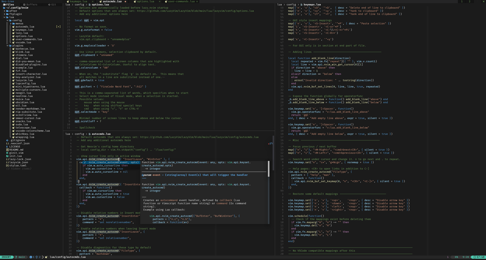

# My Neovim configuration

 

## About

This is my maximalistic [Neovim](https://neovim.io/) configuration. It uses [LazyVim](https://www.lazyvim.org/) setup.

## Differences to default LazyVim

Many LazyExtras are enabled.

Changed:

- Colorscheme
- Some default keymaps
- Some options

Added more:

- Plugins:
- Keymappings
- Autocommands
- User commands

Disabled:
- Friendly snippets -plugin

## Extra plugins

In addition to many plugins included in LazyVim:

- [multiple-cursors.nvim: A multi-cursor plugin for Neovim that works in normal, insert/replace, or visual modes, and with almost every command](https://github.com/brenton-leighton/multiple-cursors.nvim)
- [neogit: An interactive and powerful Git interface for Neovim, inspired by Magit](https://github.com/NeogitOrg/neogit)
- [obsidian.nvim: Obsidian 🤝 Neovim](https://github.com/epwalsh/obsidian.nvim) 
- [oil.nvim: Neovim file explorer: edit your filesystem like a buffer](https://github.com/stevearc/oil.nvim)
- [vim-insert-append-single-character: insert or append single characters.](https://github.com/bagohart/vim-insert-append-single-character)
- [nvim-chimera: Dublicate into a comment](https://gitlab.com/Biggybi/nvim-chimera)
- [nvim-rip-substitute: Search and replace in the current buffer with incremental preview, a convenient UI, and modern regex syntax.](https://github.com/chrisgrieser/nvim-rip-substitute)
- [vim-suda: 🥪 An alternative sudo.vim for Vim and Neovim](https://github.com/lambdalisue/vim-suda)

## Requirements

- FiraCode NerdFont
- [LazyVim requirements](https://www.lazyvim.org/)
